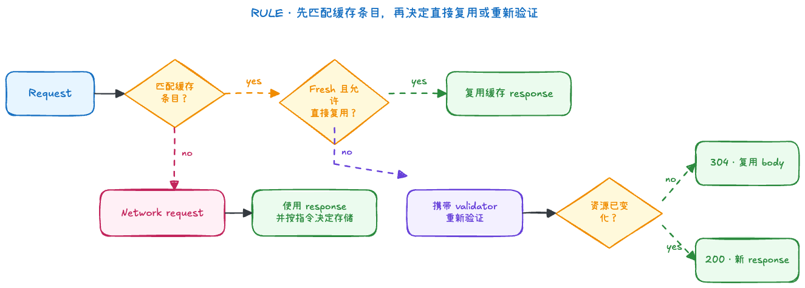

# HTTP Cache

HTTP cache 保存 HTTP response，并依据请求、响应头和当前缓存状态判断能否复用。常说的“强缓存”和“协商缓存”是便于理解的教学分类：前者通常指 fresh response 直接复用，后者通常指携带 validator 向服务器重新验证；规范本身主要使用 freshness、stale 与 validation 等术语。

## 1. 判断模型



缓存 key 至少与请求方法和目标 URI 有关，还可能受到 `Vary`、缓存分区以及浏览器实现策略影响。因此，“URL 相同”不必然意味着命中同一个缓存条目。

## 2. 面试中的“强缓存”与“协商缓存”

“强缓存”和“协商缓存”是国内面试中常用的教学术语，不是 HTTP 规范定义的两种独立缓存。它们描述的是同一个 HTTP cache entry 在不同状态下的复用方式：

| 面试术语 | 对应的 HTTP 语义                                 | 是否访问服务器 | 常见结果                                                   |
| -------- | ------------------------------------------------ | -------------- | ---------------------------------------------------------- |
| 强缓存   | 匹配的响应仍然 fresh，可以直接复用               | 否             | DevTools 可能显示 `from memory cache` 或 `from disk cache` |
| 协商缓存 | 响应需要 validation，携带 validator 发起条件请求 | 是             | 未变化返回 `304`；已变化返回新的 `200` response            |

### 2.1 强缓存

请求匹配到缓存条目，并且响应仍在 freshness lifetime 内时，缓存通常可以直接复用 response，不需要访问服务器。常见控制方式是：

```http
Cache-Control: max-age=3600
```

旧式响应也可能使用绝对时间：

```http
Expires: Wed, 21 Oct 2026 07:28:00 GMT
```

两者同时存在并且 `max-age` 适用时，优先使用 `Cache-Control: max-age`。不过，响应 fresh 不代表任何场景下一定直接复用：刷新、请求的 cache mode 等因素仍可能要求重新验证。

### 2.2 协商缓存

缓存条目已经 stale，或者 `no-cache` 等指令要求复用前验证时，浏览器可以携带 validator 发起条件请求：

```text
ETag          -> If-None-Match
Last-Modified -> If-Modified-Since
```

- 资源未变化：服务器返回 `304 Not Modified`，缓存复用本地 body，并更新相关元数据。
- 资源已变化：服务器返回新的 `200` response，缓存可能用它替换旧条目。

所以“命中协商缓存”通常是指收到 `304`，但协商过程并不保证结果一定是 `304`。

### 2.3 二者的关系

```text
同一个缓存条目
  ├─ fresh -> 直接复用                    -> 强缓存
  └─ stale / 要求验证 -> 条件请求
                         ├─ 304 -> 复用 body
                         └─ 200 -> 使用新 response   -> 协商缓存过程
```

这不是“先检查一份强缓存，再检查另一份协商缓存”。更准确的理解是：先匹配缓存条目，再根据新鲜度和请求/响应指令决定直接复用还是重新验证。

## 3. 新鲜度

响应在 freshness lifetime 内是 fresh；超过后成为 stale。常见响应指令如下：

| 指令         | 主要语义                                          |
| ------------ | ------------------------------------------------- |
| `max-age=N`  | 响应生成后的 N 秒内通常视为 fresh                 |
| `s-maxage=N` | 用于 CDN、代理等 shared cache，并优先于 `max-age` |
| `no-cache`   | 可以存储，但复用前必须验证                        |
| `no-store`   | 缓存不应存储该响应                                |
| `private`    | 仅 private cache 可以存储                         |
| `public`     | 明确允许 shared cache 在满足其他条件时存储        |
| `immutable`  | fresh 期间内容不会变化，可避免不必要的重新验证    |

`Expires` 提供绝对过期时间；存在适用的 `Cache-Control: max-age` 时，后者优先。相对时间不依赖客户端与服务端时钟完全一致，因此现代服务通常优先使用 `max-age`。

两个容易混淆的结论：

- `no-cache` 不是“不缓存”，而是“每次复用前验证”。
- `no-store` 是禁止缓存存储的核心指令，但敏感数据仍需结合身份隔离、Cookie 策略和服务端权限控制。

### 3.1 Age 不是本地计时器

缓存会根据响应生成时间、传输时间和驻留时间计算 current age，再与 freshness lifetime 比较。`Age` 响应头常由 shared cache 表示响应已在缓存链路中停留的时间，但不能只靠它完整还原浏览器内部缓存决策。

## 4. Validator 与条件请求

服务器常提供两类 validator：

- `ETag`：资源版本标识；客户端使用 `If-None-Match`。
- `Last-Modified`：最后修改时间；客户端使用 `If-Modified-Since`。

示例响应：

```http
HTTP/1.1 200 OK
Cache-Control: no-cache
ETag: "article-v42"
Content-Type: application/json

{"title":"Event Loop"}
```

再次使用前，缓存可以发出条件请求：

```http
GET /api/article/42 HTTP/1.1
If-None-Match: "article-v42"
```

若内容未改变，服务端返回 `304 Not Modified`，浏览器复用已保存的 body：

```http
HTTP/1.1 304 Not Modified
Cache-Control: no-cache
ETag: "article-v42"
```

`304` 节省的是响应 body 传输，它仍需要一次网络往返。两类 validator 同时存在时，HTTP 条件请求优先遵循 `If-None-Match` / ETag 的语义。

## 5. Vary：同一 URL 的不同表示

`Vary` 指示缓存：匹配条目时还要比较哪些请求头。例如服务器按压缩能力返回不同表示：

```http
Vary: Accept-Encoding
```

那么带有不同 `Accept-Encoding` 的请求可能匹配不同条目。使用 `Vary: *` 意味着缓存不能用普通的请求头匹配规则复用该响应，实际项目应避免把不稳定或高基数请求头随意放进 `Vary`，否则命中率会明显下降。

## 6. Private cache、Shared cache 与缓存分区

- private cache 面向单个用户代理，浏览器缓存属于这一类。
- shared cache 可被多个用户复用，CDN 和代理缓存属于这一类。
- 现代浏览器还可能把缓存按顶层站点等信息分区，以减少跨站跟踪；因此第三方资源即使 URL 相同，也不保证跨站共享同一缓存条目。

`private` 与 `s-maxage` 主要在区分这两类缓存时才有意义。不要把 DevTools 中的 memory cache / disk cache 与 HTTP 规范中的 private / shared 分类混为一谈。

## 7. Memory、Disk 与 304

| DevTools 常见展示         | 是否访问网络 | 含义                            |
| ------------------------- | ------------ | ------------------------------- |
| `200 (from memory cache)` | 通常否       | 从进程内的缓存实现复用响应      |
| `200 (from disk cache)`   | 通常否       | 从磁盘缓存实现复用响应          |
| `304 Not Modified`        | 是           | 服务端验证未变化，复用本地 body |

memory 与 disk 是浏览器实现和调试界面的存储层描述，不是 HTTP 标准定义的两种缓存语义。具体条目进入哪一层、保存多久，都不适合写成跨浏览器保证。

## 8. 导航、刷新与请求 cache mode

普通导航、刷新、强制刷新以及 DevTools 的 Disable cache 会改变请求的缓存模式。通常刷新会促使部分资源重新验证，强制刷新会绕过或重新验证更多条目，但具体请求头和内存缓存行为由浏览器决定。

JavaScript 的 `fetch` 也能通过 `cache` 选项表达请求意图：

```js
const response = await fetch("/api/profile", {
  cache: "no-cache",
})
```

这里的 `no-cache` 要求检查缓存并在使用前验证，不等于 Cache Storage，也不是让应用自行实现缓存。可选值及精确语义见 [MDN：Request.cache](https://developer.mozilla.org/en-US/docs/Web/API/Request/cache)。

## 9. 可运行 Demo

[同目录的 `index.ts`](index.ts) 用零依赖的 `node:http` 起了一个按真实部署策略缩小的站点（`node docs/browser/cache/index.ts`，打开 `http://localhost:5003`）：文档本身使用 `no-cache`，页面内五张图片各持一种策略，服务器端版本可随时修改。配合 DevTools 的 Network 面板（Size 列）与终端日志观察：

| 资源                        | 响应策略                     | fresh 期内普通刷新                  | 过期或服务器版本变化后     |
| --------------------------- | ---------------------------- | ----------------------------------- | -------------------------- |
| `/assets/fresh.svg`         | `public, max-age=60`         | 通常本地复用，服务器无请求          | 服务器改版后仍继续用旧缓存 |
| `/assets/short-fresh.svg`   | `max-age=1` + validator      | 通常本地复用                        | 1 秒后过期，条件请求 `304` |
| `/assets/no-cache.svg`      | `no-cache` + `ETag`          | 条件请求 `304`                      | 版本变化时拿到新 `200`     |
| `/assets/last-modified.svg` | `no-cache` + `Last-Modified` | 条件请求 `304`（If-Modified-Since） | 版本变化时拿到新 `200`     |
| `/assets/no-store.svg`      | `no-store`                   | 每次都是完整 `200`                  | 同左                       |

页面上的判定表格来自 `PerformanceResourceTiming`：`transferSize=0` 表示没有网络传输（强缓存复用）；有传输但 body 大小为 0 即 `304`。终端会打印每个真正到达服务器的请求及条件请求头，可与 Network 面板互相印证——强缓存命中的资源不会出现在终端。

页面还提供 `fetch` 的 `cache` 选项实验（`default` / `no-store` / `no-cache` / `force-cache` / `only-if-cached`）：修改 `fresh.svg` 的服务器版本后，`force-cache` 会不发任何请求地返回旧版本，`no-cache` 则通过条件请求拿到新版本。

> 普通刷新、硬刷新与 Disable cache 绕过缓存的程度由浏览器实现决定，Chrome 与 Firefox 表现不同；`memory cache` 与 `disk cache` 的归属同样不可跨浏览器比较。

## 10. 部署策略

入口 HTML 需要较快获得新版本，可使用 `no-cache`，或使用较短的 `max-age` 并提供 validator。文件名含 content hash 的 JS、CSS 和图片在内容变化时会更换 URL，可以长期缓存：

```http
Cache-Control: public, max-age=31536000, immutable
```

一次稳妥的部署顺序是：先上传新 hash 资源，再切换 HTML，并在一段时间内保留旧资源。否则仍持有旧 HTML 的客户端可能请求到已经删除的旧 chunk。

接口响应是否可缓存不能只看 GET：还要考虑用户身份、授权检查、`Vary`、共享缓存以及数据更新频率。包含用户私有内容的响应通常至少要避免被 shared cache 错误复用。

## 11. 与另外两种“缓存”的边界

- [Cache Storage](../pwa/cacheStorage.md) 是 JavaScript 可编程的 `Request` / `Response` 存储，不会自动替你执行 HTTP freshness 和 validation。
- [BFCache](./bfcache.md) 保存整份页面的运行状态，用于历史导航恢复，不是资源响应缓存。

排查缓存时应同时检查 Network 中的 request/response headers、Size、缓存来源标记和 Service Worker，而不是只看状态码。

## 12. 面试回答框架

可以先直接回答：

> 强缓存和协商缓存是教学分类。强缓存对应匹配的 response 仍然 fresh，浏览器可以直接复用，不产生网络请求，通常由 `Cache-Control: max-age` 控制。协商缓存对应缓存需要重新验证，浏览器通过 `If-None-Match` 或 `If-Modified-Since` 询问服务器；未变化时返回 `304` 并复用本地 body，发生变化时返回新的 `200` response。`no-cache` 表示复用前必须验证，并不表示不存储。

继续追问时，可以按四步展开：先说明缓存条目如何匹配；再说明 freshness；然后说明 validator 和条件请求；最后补充 `Vary`、private/shared cache、缓存分区和部署策略。也可引用[本目录 demo](#9-可运行-demo) 的五种策略对照与“改了版本但强缓存继续用旧内容”的实验。这样比只背“强缓存优先于协商缓存”更接近真实决策过程。

## 13. 参考资料

- [RFC 9111：HTTP Caching](https://httpwg.org/specs/rfc9111.html)
- [MDN：HTTP caching](https://developer.mozilla.org/en-US/docs/Web/HTTP/Guides/Caching)
- [MDN：Cache-Control](https://developer.mozilla.org/en-US/docs/Web/HTTP/Reference/Headers/Cache-Control)
- [MDN：ETag](https://developer.mozilla.org/en-US/docs/Web/HTTP/Reference/Headers/ETag)
