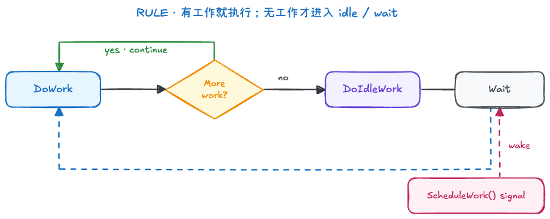
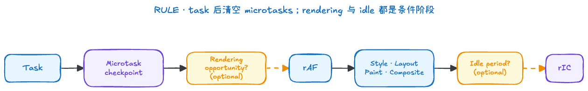

# Browser Event Loop

事件循环需要区分“Web 规范”和“浏览器实现”两个层次：

- **当前 HTML 规范**：WHATWG [HTML Living Standard：Event loops](https://html.spec.whatwg.org/multipage/webappapis.html#event-loops) 持续维护 event loop、task queue 和 microtask queue 等模型。W3C HTML 5.2 的 [Event loops](https://www.w3.org/TR/2017/REC-html52-20171214/webappapis.html#event-loops) 已是历史 Recommendation，可作为旧版参考。
- **Chromium 实现**：Chromium 使用 task、task queue、`SequenceManager` 和 `MessagePump` 等组件实现任务调度，参见 [Threading and Tasks in Chrome（固定版本）](https://chromium.googlesource.com/chromium/src/+/39cea72b3a158dda6cd7c951611b3da13bef600b/docs/threading_and_tasks.md)和 [最新 main](https://chromium.googlesource.com/chromium/src/+/main/docs/threading_and_tasks.md)。这是 Blink/Chromium 的具体实现，不是 HTML 规范要求所有浏览器采用的内部结构。

下文主要讨论页面中的 Window Event Loop，以 HTML Standard 的模型解释可观察行为，并在适当位置补充 Chromium/Blink 的实现。Worker 拥有自己的 event loop；Node.js Event Loop 不在本文范围内。

文中的 Chromium 源码摘录最后核对于 2026-09-19，对应 commit `39cea72b3a158dda6cd7c951611b3da13bef600b`；固定版本用于保证摘录与链接一致，`main` 链接用于查看后续变化。

## 1. 进程与线程

进程拥有相对独立的地址空间和系统资源，线程共享所属进程的内存。多进程能提高故障隔离、安全隔离和并行能力，代价是更多内存及 IPC 开销。

Chromium 常见进程包括（参见 [Multi-process Architecture](https://www.chromium.org/developers/design-documents/multi-process-architecture/)）：

| 进程             | 主要职责                                        |
| ---------------- | ----------------------------------------------- |
| Browser Process  | 浏览器 UI、导航协调、权限、输入路由和子进程管理 |
| Network Service  | DNS、连接、HTTP、缓存等网络工作                 |
| Renderer Process | 解析页面、执行页面脚本、样式布局和绘制          |
| GPU/Viz Process  | 光栅化、跨页面合成及向系统提交画面              |

Chrome 会依据 [Site Isolation](https://www.chromium.org/developers/design-documents/site-isolation/)、站点关系、iframe 和资源限制分配 Renderer Process。一个标签页可能涉及多个渲染进程，多个同站页面也可能复用进程，因此不能概括为“一标签页一个进程”。

对于后文的 Event Loop，关注点主要是 Renderer Process 中执行页面任务的 Blink 主线程。

## 2. 渲染主线程

一个 Renderer Process 通常只有一条 Blink 渲染主线程。与 Event Loop 直接相关的工作主要包括：

- 执行页面 JavaScript；
- 分发 DOM 事件，执行事件处理函数；
- 执行计时器等异步 API 的回调；
- 参与 DOM 更新以及页面渲染相关工作。

HTML/CSS 解析、样式计算、布局、绘制、分层与合成的具体过程见 [Browser Rendering](../rendering.md)。本文只关注这些工作与 JavaScript、事件和异步回调共享主线程时产生的调度关系。

Web Worker 可在其他线程执行脚本，但不能直接操作当前页面 DOM。Chromium 文档也将 renderer process 的主线程称为 Blink main thread，并说明它运行 Blink 的大部分工作，参见 [Threading and Tasks in Chrome：Threads](https://chromium.googlesource.com/chromium/src/+/39cea72b3a158dda6cd7c951611b3da13bef600b/docs/threading_and_tasks.md#threads)。

JavaScript 与 DOM 更新集中在同一主线程，使脚本执行与页面结构修改保持确定顺序。代价是长时间脚本会同时延迟输入处理、计时器和渲染。

浏览器并非“无论如何都不能阻塞”：同步循环、布局计算和事件回调都可能阻塞主线程。异步 API 只把等待或部分工作交给宿主，回调最终在主线程执行时仍可能形成 Long Task。

## 3. Task 与 Microtask

HTML 事件循环维护一个或多个 task queue。计时器、用户交互、网络事件等任务来自不同 task source；同一个 task source 产生的任务不会被乱序执行，但浏览器可以按规范约束和自身调度策略选择从哪个 task queue 取出可运行任务。因此，代码不能依赖某类普通 task 永远优先于另一类。

一次简化的循环过程：

1. 选择并执行一个 task，直到调用栈清空。
2. 执行 microtask checkpoint，持续清空 microtask queue。
3. 到达合适时机时执行渲染更新，包括 `requestAnimationFrame` 回调、样式、布局与绘制。
4. 继续选择下一个 task，或在没有工作时等待。

常见 microtask 来源：

- `Promise.then/catch/finally`
- `queueMicrotask()`
- `MutationObserver` 通知

`Promise.resolve()` 只创建已兑现 Promise，不会单独排入回调；需要调用 `.then()`。

```js
console.log("sync")

setTimeout(() => console.log("timer"), 0)
queueMicrotask(() => console.log("microtask"))
Promise.resolve().then(() => console.log("promise"))

// sync -> microtask -> promise -> timer
```

每个 microtask 还可以继续添加 microtask，因此递归调度可能让浏览器迟迟无法进入渲染和下一个 task，形成 microtask starvation。

### 常见队列间的执行关系

`Promise > user interaction > fetch/XHR` 是一种常见但不严谨的简化，不能作为优先级公式。更准确的理解是：

1. **正在执行的 task 不会被抢占**：即使此时发生用户输入，也要等当前 JavaScript task 结束。
2. **microtask checkpoint 先于下一个 task**：当前 task 结束后，会持续处理已经入队的 Promise reaction、`queueMicrotask()` 等 microtask。因此，如果 Promise reaction 此时已经入队，它会先于下一个 user interaction、网络或计时器 task。
3. **不同普通 task queue 之间没有跨浏览器固定顺序**：浏览器可以偏向 user interaction task 以保持响应性，但不能保证它永远先于网络和计时器 task。
4. **idle callback 取决于空闲期或超时**：它通常只有在浏览器进入 idle period 时才可运行；如果设置的 `timeout` 到期，浏览器会改走超时路径，将执行 callback 的 task 排入队列。

需要特别区分 `fetch` 的两个阶段：网络完成由宿主和 networking task 推进；当它使 Promise 兑现后，`.then()` 回调才作为 microtask 在随后的 microtask checkpoint 执行。所以“Promise 比 fetch 优先”只有在 Promise reaction 已经入队时才有意义，不能让一个尚未完成的请求越过已经可运行的 user interaction task。

| 常见来源                         | 队列/阶段                                                       | 可以依赖的关系                                                  |
| -------------------------------- | --------------------------------------------------------------- | --------------------------------------------------------------- |
| `Promise.then`、`queueMicrotask` | microtask queue                                                 | 在当前 task 结束后的 checkpoint 中、下一个普通 task 之前执行    |
| 点击、键盘等事件                 | user interaction task source，以及浏览器内部输入队列            | 浏览器通常偏向及时响应，但普通 DOM 事件没有“永远第二”的规范保证 |
| `fetch`、XHR 事件                | networking task source；`fetch().then()` 最终还会产生 microtask | 请求何时完成不可预测；与其他普通 task 没有固定全局顺序          |
| `setTimeout`、`setInterval`      | timer task source                                               | 到期仅代表获得执行资格，还会受到主线程占用和节流影响            |
| `requestIdleCallback`            | idle-task task source/浏览器空闲期                              | 无 `timeout` 时可能长期不运行，不适合必须按时完成的工作         |

这里描述的是网页可以依赖的执行关系。Blink 如何给普通 task queue 计算动态优先级，以及开发者应如何选择 rAF、idle callback、`postTask()` 和 `yield()`，见 [Browser Scheduling](../scheduling.md)。

## 4. 异步任务如何返回

### 异步结果如何进入主线程

计时器到期、网络数据可用或输入发生后，宿主会把相应任务变为可运行状态。主线程必须先完成当前 task 和随后的 microtask checkpoint，才可能执行它。常见来源包括：

- 计时器：`setTimeout`、`setInterval`；
- 网络：`fetch`、`XMLHttpRequest`；
- 用户或 DOM 事件：`addEventListener` 注册的回调。

### Chromium MessagePump 的实现直觉

> 以下内容用于理解 Chromium 底层的“执行—等待—唤醒”机制，并不是 Blink Window Event Loop 与某个 C++ 循环的一一对应关系。

从 Chromium 的底层实现看，`SequenceManager` 会把多个 task queue 复用到一个 backing sequence，通常再由 `MessagePump` 驱动。以默认 message pump 为例，其 [`MessagePumpDefault::Run()`](https://chromium.googlesource.com/chromium/src/+/39cea72b3a158dda6cd7c951611b3da13bef600b/base/message_loop/message_pump_default.cc) 中存在 `for (;;)` 循环：先请求可执行工作，没有即时工作时执行 idle work，然后等待下一项工作或延时到期；`ScheduleWork()` 可以从其他线程发出信号将其唤醒。后续变化可查看[最新 main](https://chromium.googlesource.com/chromium/src/+/refs/heads/main/base/message_loop/message_pump_default.cc)。



下面是去掉平台分支、busy-loop 和 tracing 后的核心流程：

```cpp
void MessagePumpDefault::Run(Delegate* delegate) {
  for (;;) {
    Delegate::NextWorkInfo next_work_info = delegate->DoWork();
    if (!keep_running_)
      break;
    if (next_work_info.is_immediate())
      continue;

    delegate->DoIdleWork();
    if (!keep_running_)
      break;

    event_.TimedWait(next_work_info.remaining_delay());
  }
}

void MessagePumpDefault::ScheduleWork() {
  event_.Signal();
}
```

这段源码可以帮助理解“取任务—执行—等待—唤醒”的实现直觉，但 Chromium 在不同平台和线程上会采用不同类型的 message pump，不能把这一份 C++ 流程直接等同于 HTML Event Loop 规范。

### 长任务为什么会阻止渲染

```js
const heading = document.querySelector("h1")
const button = document.querySelector("button")

function block(duration) {
  const start = performance.now()
  while (performance.now() - start < duration) {}
}

button.addEventListener("click", () => {
  heading.textContent = "changed"
  block(3000)
})
```

DOM 已经修改，但浏览器通常要等当前 callback 和 microtask 执行完，获得渲染机会后才把新内容呈现在屏幕上，所以用户会在约 3 秒后看到变化。

## 5. 渲染时机

渲染不是每轮事件循环必然发生，也不保证固定 60 FPS。浏览器会结合显示器刷新率、页面可见性、是否需要更新及性能情况选择渲染机会。

微任务通常发生在当前 task 之后、渲染机会之前。到达合适的渲染机会时，可以用下面的简化草图理解一帧中的主要阶段：



这不是每轮 Event Loop 都必然执行的固定流水线：浏览器可能跳过本轮渲染，具体渲染算法也包含更多观察器和内部步骤。草图的重点是 `requestAnimationFrame` 发生在预计绘制前，而 idle callback 只有在浏览器判断仍有空闲时间时才有机会执行。

因此，`requestAnimationFrame` 适合在下一次预计绘制前更新视觉状态；它不是 microtask，也不等价于 `setTimeout(fn, 16)`。

`requestIdleCallback` 的预算、超时、分片用法和兼容性见 [Browser Scheduling：requestIdleCallback](../scheduling.md#5-requestidlecallback)。

## 6. setTimeout 为什么不精确

`setTimeout(fn, delay)` 表示经过至少 delay 后，回调才有资格排队，不承诺该时刻立即执行。偏差来自：

1. 当前 task、microtask 或其他任务占用主线程。
2. 嵌套计时器达到规范规定的 nesting level 后，小于 4ms 的延迟会被钳制到至少 4ms。
3. 后台页面的计时器会被节流，浏览器还可能批处理任务。
4. 操作系统调度、设备负载和省电策略带来额外延迟。

因此动画使用 `requestAnimationFrame`，精确耗时使用 `performance.now()` 计算实际时间；倒计时应根据目标时间校正，而不是假设每次 interval 都准时。

这里的 nesting level 指“在计时器 task 中继续创建计时器”形成的调度链，不是源代码中函数或代码块的书写层级。例如：

```js
let nestingCount = 0

function scheduleNextTimer() {
  const scheduledAt = performance.now()

  setTimeout(() => {
    const actualDelay = performance.now() - scheduledAt
    console.log(nestingCount, actualDelay)

    nestingCount += 1
    if (nestingCount < 10) {
      scheduleNextTimer()
    }
  }, 0)
}

scheduleNextTimer()
```

每次 `setTimeout` 都是在上一个 timer task 中创建下一个计时器，因此 nesting level 会沿着这条链增加。达到规范层级后，小于 4ms 的 delay 会被钳制为至少 4ms；实际观测值仍可能因为调度和系统负载更大。

HTML Standard 的规则是：计时器 nesting level 大于 5 且延迟小于 4ms 时，将延迟设为 4ms。当前 Blink 源码 [`dom_timer.cc`](https://chromium.googlesource.com/chromium/src/+/39cea72b3a158dda6cd7c951611b3da13bef600b/third_party/blink/renderer/core/scheduler/dom_timer.cc) 对应实现如下，后续变化可查看[最新 main](https://chromium.googlesource.com/chromium/src/+/refs/heads/main/third_party/blink/renderer/core/scheduler/dom_timer.cc)：

```cpp
constexpr int kSpecCompliantMaxTimerNestingLevel = 6;
constexpr base::TimeDelta kMinimumInterval = base::Milliseconds(4);
```

这里使用 `6` 而不是旧实现中常见的 `5`，是因为该文件的计数从 1 开始，而规范算法从 0 开始。理解重点应是“连续嵌套达到相应层级后进行 4ms 钳制”，而不是依赖某个可能变化的 C++ 常量名。

## 7. 常见浏览器 API 如何进入调度模型

调用浏览器 API 不等于立刻创建一个 task。需要区分 API 调用本身、宿主在后台完成的工作，以及最终执行 callback 的调度机制。

例如，设置图片地址只会启动资源加载；网络层取得响应后，HTML 图片加载算法会在适当的任务中分发 `load` 事件，监听器再在该次事件分发过程中同步执行：

```js
const image = new Image()

image.addEventListener("load", () => {
  console.log("image loaded")
})

image.src = "/hero.png"
```

常见 API 可以这样归类：

| API 或场景                    | 调度机制                                     | 说明                                                                                |
| ----------------------------- | -------------------------------------------- | ----------------------------------------------------------------------------------- |
| `setTimeout`、`setInterval`   | timer task                                   | delay 到期只表示任务获得执行资格                                                    |
| 用户触发的 `click`、`keydown` | user interaction task                        | 浏览器排入相关任务，事件监听器在事件分发时同步执行                                  |
| `addEventListener()`          | 不直接产生 task                              | 只注册监听器；监听器何时执行取决于事件来源                                          |
| `element.dispatchEvent()`     | 当前调用栈同步执行                           | 不创建新 task；返回前会完成本次事件分发                                             |
| `fetch()`                     | networking work → Promise reaction microtask | 网络工作使 Promise 改变状态后，`.then()` 等 reaction 在 microtask checkpoint 中执行 |
| XHR 的 `load` 等事件          | networking task 中分发 DOM Event             | 事件来自网络进度，但监听器仍在事件分发过程中同步执行                                |
| 图片的 `load` 事件            | 由图片资源加载算法安排事件分发               | 不应仅根据“来自网络”推断它在所有路径中都使用同一个 task source                      |
| `queueMicrotask()`            | microtask                                    | 在下一次 microtask checkpoint 中执行                                                |
| `MutationObserver`            | microtask 通知机制                           | DOM 变化不会为每次 mutation 单独创建普通 task                                       |
| `requestAnimationFrame()`     | 渲染更新步骤                                 | 在预计绘制前调用，不是普通 task 或 microtask                                        |
| `requestIdleCallback()`       | idle period 或 timeout task                  | 空闲期不一定出现；timeout 到期时走超时任务路径                                      |

因此，“异步 API”不是一种统一的队列类别。分析代码时应先确定 callback 属于普通 task、microtask、渲染更新步骤还是 idle callback，再讨论它与其他工作的相对顺序。

各 API 应用于动画、低优先级工作或主动让步时的选型见 [Browser Scheduling](../scheduling.md#3-web-调度-api-如何选)。

## 8. 面试回答框架

先给出 30 秒回答，再根据追问展开正文细节：

| 问题                                   | 30 秒回答                                                                                                      | 详细位置   |
| -------------------------------------- | -------------------------------------------------------------------------------------------------------------- | ---------- |
| Event Loop 如何工作？                  | 主线程执行一个 task，随后进行 microtask checkpoint；浏览器可能更新渲染，然后再选择下一个可运行 task            | 第 3、5 节 |
| 如何分析执行顺序？                     | 依次列出同步代码、本轮产生的 microtask、可能的渲染机会和后续 task；不同 task source 没有规范保证的固定全局顺序 | 第 3 节    |
| task 与 microtask 有什么区别？         | microtask 会在 checkpoint 中持续处理，先于下一个普通 task；递归添加可能导致 starvation                         | 第 3 节    |
| 为什么 `setTimeout` 不精确？           | delay 是最短等待时间，不是执行时刻；主线程占用、4ms 钳制、后台节流和系统调度都会增加延迟                       | 第 6 节    |
| JavaScript 为什么常被称为单线程？      | 同一页面中可同步访问同一 DOM 的 JavaScript 通常按顺序运行在同一主线程；不代表浏览器只有一个线程                | 第 2 节    |
| rAF 与 `setTimeout(fn, 16)` 有何区别？ | rAF 与预计绘制时机协调；计时器只在至少等待相应时间后获得执行资格                                               | 第 5 节    |
| 常见浏览器 API 都会创建 task 吗？      | 不会；有些 API 产生普通 task，有些产生 microtask，`dispatchEvent()` 同步执行，rAF 则属于渲染更新步骤           | 第 7 节    |
| 规范模型与 Chromium 实现如何区分？     | HTML Standard 规定网页可依赖的行为；Blink scheduler、`SequenceManager` 和 `MessagePump` 是可能变化的工程实现   | 第 3、4 节 |

回答代码执行顺序题时，可以按以下顺序书写：

1. 执行当前 task 的同步代码，记录它产生的 microtask 和后续 task。
2. 调用栈清空后执行 microtask checkpoint；新加入的 microtask 也在本轮继续处理。
3. checkpoint 完成后，标出可能的渲染机会，而不是断言必然渲染。
4. 再分析计时器、用户交互和网络等后续 task。
5. 涉及不同 task source、后台节流或 Blink 优先级时，说明哪些是规范保证、哪些只是实现策略。

常见误区：

- 把 microtask 说成“最高优先级的普通 task queue”；
- 认为每执行一个 task 都会渲染；
- 认为 `setTimeout(fn, delay)` 会在 delay 时刻准时执行；
- 把 JavaScript 单线程理解成整个浏览器只有一个线程；
- 认为所有异步 API 的 callback 都来自同一个普通 task queue。
