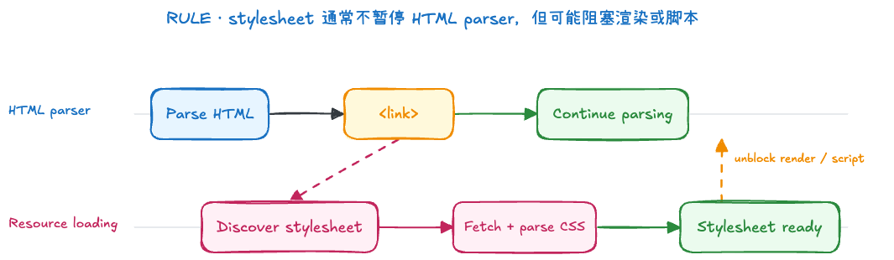
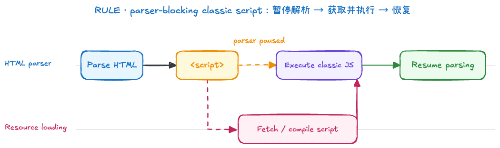
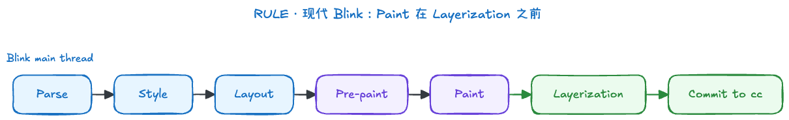
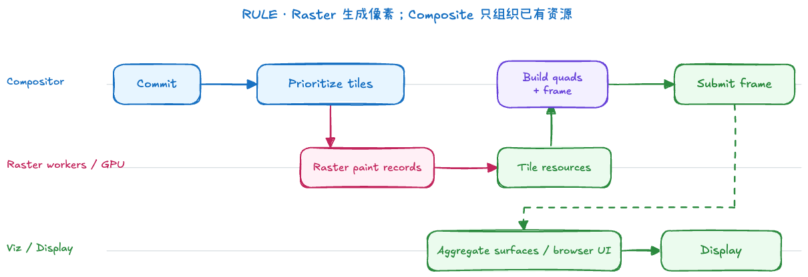

# Browser Rendering

浏览器渲染需要区分“Web 规范”和“浏览器实现”两个层次：

- **Web 规范**：HTML、CSS Cascade、CSS Display 和 CSSOM View 等规范定义文档解析、层叠、盒生成以及几何 API 的可观察行为，但不要求浏览器采用完全相同的内部流水线。
- **Chromium/Blink 实现**：本文使用 Chromium 的 [RenderingNG](https://developer.chrome.com/docs/chromium/renderingng) 和 Blink [Paint 文档](https://chromium.googlesource.com/chromium/src/+/main/third_party/blink/renderer/core/paint/README.md)帮助理解主流实现。这些阶段和名称是工程实现，不应直接当成所有浏览器的内部结构。

以页面首次显示为例，可以把主流程概括为：

```text
HTML/CSS parse → style → layout → pre-paint → paint → layerize → tile → raster → composite → display
```

这是一条理解模型，不是每次更新都完整执行的固定流水线。浏览器会跟踪失效范围并复用已有结果；滚动或满足条件的合成动画可能只需要合成已有内容。HTML/CSS 解析主要为首次加载和后续新增内容提供输入，也不是每一帧都会重新执行。

首次渲染与后续更新可以这样区分：

| 场景                      | 可能进入的阶段                                                              | 说明                                             |
| ------------------------- | --------------------------------------------------------------------------- | ------------------------------------------------ |
| 首次加载页面              | parse → style → layout → pre-paint/paint/layerize → tile/raster → composite | 需要从资源和文档构建初始结构                     |
| 修改 DOM 或影响布局的样式 | style → layout → pre-paint/paint → raster → composite                       | 通常只更新失效的范围，不重新解析整份 HTML        |
| 只改变绘制外观            | style → pre-paint/paint → raster → composite                                | 例如普通元素的背景色发生变化，通常不需要重新布局 |
| 满足合成条件的属性变化    | composite                                                                   | 可以复用已光栅化内容时，可能只更新合成属性       |

表格中的阶段仍是常见路径，不是属性与阶段的永久映射；浏览器可以根据失效范围、缓存和合成状态跳过部分工作。

## 1. Parse

HTML parser 将字节解码后的字符流转换成 token，并按照 HTML 纠错规则构建 DOM，具体算法见 WHATWG [Parsing HTML documents](https://html.spec.whatwg.org/multipage/parsing.html)。CSS parser 解析已加载的样式表并形成规则的内部表示；[CSSOM](https://drafts.csswg.org/cssom/) 则定义脚本如何访问和修改样式表，不应直接等同于 Blink 的全部内部样式数据结构。

浏览器还可以在主 parser 被脚本等工作阻塞时向前扫描可发现的 URL，提前请求 CSS、JavaScript、字体和图片。这通常称为 preload scanner 或 speculative parser；它表达的是“提前发现资源”的机制，不代表所有浏览器都必须创建一条固定的“预解析线程”。



> 图中两条泳道表达“资源发现、加载与主解析可以解耦”的概念关系，不是 Chromium 当前线程结构的严格示意。

外部样式表通常不会暂停 HTML parser 继续构建 DOM，但符合条件的 stylesheet 会成为 render-blocking 资源，从而延迟页面首次渲染。是否阻塞还会受到 `media`、加载方式和元素状态等条件影响，不能概括为“所有外部 CSS 都阻塞渲染”。

parser-inserted、没有 `async` 或 `defer` 的经典外部脚本通常会暂停 HTML 解析，等待脚本下载并执行。若它前面还有会阻塞脚本的样式表，脚本执行也需要等待这些样式表，因为脚本可能读取依赖样式的结果。脚本执行期间又可能通过 `document.write` 或 DOM API 修改正在构建的文档，因此 parser 不能简单越过它继续构建 DOM。



> 图中的资源加载泳道只表示获取工作可与主解析解耦；脚本的实际获取、编译与执行还涉及更多组件。

`async`、`defer` 与 module script 的差异详见 [Resource Loading](../resourceLoading.md)。

## 2. Style

浏览器根据 UA 样式、用户样式、作者样式、层叠、继承和选择器匹配，为需要渲染的节点计算 computed style。层叠规则由 [CSS Cascading and Inheritance](https://drafts.csswg.org/css-cascade/) 定义。

一个 CSS 属性从样式声明到实际显示，大致会经过以下值阶段：

| 阶段            | 含义                                               |
| --------------- | -------------------------------------------------- |
| declared values | 元素上所有可能参与层叠的声明值                     |
| cascaded value  | 根据来源、重要性、层、specificity 和顺序选出的结果 |
| specified value | 补上继承值或初始值后，属性确定的指定值             |
| computed value  | 解析继承和部分相对值后得到的结果，可供后代继承     |
| used value      | 结合包含块、字体度量和布局约束后实际用于布局的值   |
| actual value    | 考虑像素取整、设备和实现限制后最终使用的值         |

这些阶段是 CSS 规范的值处理模型，不等于 Blink 必须依次创建六份对象。computed value 也不一定是最终用于布局的数值：部分百分比尺寸需要在 Layout 阶段知道可用空间后才能确定 used value。因此，不应把 Style 理解成“所有 CSS 属性都已经转换成最终像素值”。

`getComputedStyle()`、几何 API 与这些值阶段的关系见第 4 节。

## 3. Layout

布局依据盒模型、格式化上下文、包含块、字体和内容，计算盒子的尺寸与位置。规范主要描述盒生成与布局结果；在 Blink 中，可以用 layout objects 和 fragments 理解其内部结果，但这些名称不是 Web 平台 API。

DOM 与布局结构不是一一对应：

- `display: none` 的元素仍存在于 DOM 中，但不会为自身及其后代生成布局盒；
- `::before`、`::after` 等伪元素可以产生布局内容，但不是普通 DOM 子节点；
- 一个 DOM 元素在行内换行、多列或分页时可能生成多个 fragment。

### 为什么 `head`、`link` 等元素没有布局盒

`head`、`link` 等节点存在于 DOM 中，但 Chromium/Blink 的 user-agent stylesheet（浏览器预设样式表）为它们设置了 `display: none`。下面是 old 版本中保留的 preset；本文最后核对于 2026-09-19，对应 Chromium commit `39cea72b3a158dda6cd7c951611b3da13bef600b`，可以查看 [`html.css` 固定版本](https://chromium.googlesource.com/chromium/src/+/39cea72b3a158dda6cd7c951611b3da13bef600b/third_party/blink/renderer/core/html/resources/html.css)以及[最新 main](https://chromium.googlesource.com/chromium/src/+/main/third_party/blink/renderer/core/html/resources/html.css)：

```css
base,
basefont,
datalist,
head,
link,
meta,
noembed,
noframes,
param,
rp,
script,
style,
template,
title {
  display: none;
}
```

这段代码展示的是 Blink 如何实现 HTML 的默认渲染规则，不是所有浏览器都必须使用的同一份 CSS 文件。`display: none` 的准确含义也不是“创建一个不可见盒”，而是不为该元素及其后代生成盒。因此，这些节点可以存在于 DOM、参与解析或提供元数据，却不进入通常所说的布局盒树。

### Block box、inline box 与 line box

这些名称描述不同层次的结构，不能把它们都简称为“行盒/块盒”后直接比较：

| 概念                 | 作用                                                                                  |
| -------------------- | ------------------------------------------------------------------------------------- |
| block-level box      | 在 block formatting context 中参与布局，通常沿块方向依次排列                          |
| inline-level box     | 在 inline formatting context 中参与布局，例如普通 inline box、inline-block 和替换元素 |
| anonymous inline box | 没有对应 inline 元素，通常由块容器直接包含的文本形成                                  |
| line box             | inline formatting context 为容纳一行 inline-level 内容而生成的矩形区域                |
| anonymous block box  | 块容器同时出现 block-level 与 inline-level 内容时，用于修正 box tree 结构             |

例如：

```html
<div>
  <p>a</p>
  b
  <p>c</p>
</div>
```

假设 `div` 和 `p` 都生成 block box，两个 `p` 之间的文本 `b` 是 inline-level 内容。为了让 `div` 的流内子盒统一为 block-level boxes，CSS 会在这段文本外生成 anonymous block box；文本自身形成 anonymous inline box，并在该匿名块建立的 inline formatting context 中被排入 line box：

```text
div block container
├── p block box
├── anonymous block box
│   └── line box
│       └── anonymous inline box: "b"
└── p block box
```

因此，old 中“内容必须在行盒中，如果没有就添加匿名行盒”和“行盒与块盒不能相邻”的说法不够准确：

- 文本或 inline 元素先产生 inline-level boxes，浏览器再按可用宽度把它们排入一个或多个 line boxes；
- 当块容器混合 block-level 与 inline-level 内容时，用来修正结构的是 anonymous block box，不是“匿名行盒”；
- line box 属于 inline formatting context 内部，不应把它理解为普通 block box 的同级盒类型。

相关规则可参考 [CSS Display：Box Generation](https://drafts.csswg.org/css-display/#box-generation)、[CSS 2.2：Anonymous block boxes](https://www.w3.org/TR/CSS22/visuren.html#anonymous-block-level) 与 [Inline formatting contexts](https://www.w3.org/TR/CSS22/visuren.html#inline-formatting)。

布局通常是增量进行的。DOM、样式或资源变化会使受影响的部分进入待更新状态，浏览器会尽量限制重新计算的范围，而不是每次都从头布局整个页面。

## 4. 浏览器 API 读取的是哪个渲染阶段

JavaScript 读取到的不是一份统一的“页面最终结果”。不同 API 分别暴露样式声明、resolved value、布局几何或滚动状态；普通 Web API 不会直接返回 Blink 的 Paint Artifact、光栅化后的 tile 或 composited layer。

| API                         | 主要读取的内容                                                     | 对应阶段                   | 关键边界                                                                                                  |
| --------------------------- | ------------------------------------------------------------------ | -------------------------- | --------------------------------------------------------------------------------------------------------- |
| `element.style`             | 元素 `style` attribute 中的行内声明                                | DOM/CSSOM                  | 不执行层叠，不能代表最终生效样式                                                                          |
| `getComputedStyle(element)` | 属性的 resolved value                                              | Style；部分属性依赖 Layout | 大多数属性返回 computed value；已生成盒的 `width`、`height`、margin、padding、inset 等可能返回 used value |
| `offsetWidth/offsetHeight`  | 所有相关 fragment 的轴对齐 border-box 包围尺寸                     | Layout                     | 返回整数 CSS 像素，忽略元素及祖先的 transform；没有布局盒时返回 `0`                                       |
| `offsetTop/offsetLeft`      | 元素 border edge 相对 `offsetParent` padding edge 的位置           | Layout                     | 使用历史 offset 模型，忽略 transform；不等于视口坐标                                                      |
| `clientWidth/clientHeight`  | 元素 padding box 的内部尺寸                                        | Layout                     | 不含 border 和滚动条；普通 inline box 返回 `0`；根元素以及 quirks mode 的 `body` 有 viewport 特例         |
| `clientTop/clientLeft`      | border 宽度，以及相应方向上位于 border 与 padding 之间的滚动条尺寸 | Layout                     | 普通 inline box 返回 `0`；它们不是元素相对父级的坐标                                                      |
| `scrollWidth/scrollHeight`  | scrolling area 的完整尺寸                                          | Layout/Overflow            | 可以大于可见的 `clientWidth/clientHeight`                                                                 |
| `scrollTop/scrollLeft`      | 当前滚动位置                                                       | Scroll state               | 读取滚动状态；设置它们会请求滚动，不代表重新执行完整渲染流水线                                            |
| `getClientRects()`          | 元素各个 fragment 的矩形集合                                       | Layout + transforms        | 一个多行 inline 元素可能返回多个矩形                                                                      |
| `getBoundingClientRect()`   | 所有非空 client rect 的轴对齐包围矩形                              | Layout + transforms        | 返回 viewport 坐标，会反映 transform 和当前滚动位置                                                       |

`getComputedStyle()` 这个名字容易造成误解。CSSOM 实际定义的是 [resolved value](https://drafts.csswg.org/cssom/#resolved-values)：多数属性的 resolved value 是 computed value，但部分布局相关属性在元素生成盒时返回 used value。它返回的是只读样式视图，不是“Paint 之后屏幕上最终像素的颜色与尺寸”。

`offset*`、`client*`、`scroll*` 和矩形 API 由 [CSSOM View](https://drafts.csswg.org/cssom-view/) 定义，主要建立在布局盒、fragment、滚动区域和 transform 几何之上。特别需要区分：`offsetWidth` 忽略 transform，而 `getBoundingClientRect()` 会反映 transform，所以旋转或缩放后的两个结果可能不同。

### 读取是否一定触发同步布局

这些 API 返回哪个阶段的数据，与调用它们是否产生额外计算是两个问题：

- 如果 Style 和 Layout 已经是 clean，读取布局几何通常可以直接使用已有结果；
- 如果前面的 DOM/CSS 修改使 Style 或 Layout 处于 dirty 状态，读取依赖最新几何的 API 可能迫使浏览器在当前 JavaScript task 中同步结算；
- `getComputedStyle()` 至少可能要求样式更新；读取布局相关的 resolved value 时，还可能需要最新布局；
- 是否发生同步更新取决于当前文档状态和所读属性，不能只根据 API 名称判断。

```js
const box = document.querySelector(".box")

box.style.width = "200px" // Marks style/layout as dirty.
const width = box.offsetWidth // May force a synchronous style/layout update.
```

因此，性能问题通常不是“读取”本身，而是反复交错写入和读取，让浏览器无法批量处理更新。

## 5. Pre-paint、Paint 与 Layerization

在现代 Blink 的理解模型中，顺序是 `layout → pre-paint → paint → layerization`，而不是旧资料中常见的 `layout → layer → paint`。

Pre-paint 主要为后续绘制准备 transform、clip、effect 和 scroll 等属性信息，并确定哪些已有绘制结果已经失效。Paint 再按照绘制顺序生成背景、边框、文字等绘制指令；它不是在调用页面的 Canvas API。

Blink 将这些绘制结果组织成 display items 和 paint chunks，整体结果常称为 Paint Artifact。随后，layerization 根据绘制内容及其属性决定如何组织交给 compositor 的内容。这里知道概念关系即可，具体内部数据结构可参考 Blink 的 [Paint architecture](https://chromium.googlesource.com/chromium/src/+/main/third_party/blink/renderer/core/paint/README.md)。

### Paint invalidation

页面已有绘制结果后，浏览器不需要在每次变化时重新记录整页。DOM、Style 或 Layout 的变化会标记可能需要重新绘制的对象和区域；Pre-paint 阶段检查这些失效信息，Paint 尽量复用仍然有效的绘制记录，只重新生成发生变化的部分。

需要区分几个相关但不同的动作：

| 动作                | 解决的问题                                   |
| ------------------- | -------------------------------------------- |
| style invalidation  | 哪些元素需要重新匹配规则或计算样式           |
| layout invalidation | 哪些盒子的尺寸、位置或 fragment 需要重新计算 |
| paint invalidation  | 哪些绘制记录已经不能复用                     |
| raster invalidation | 已有 tile 中哪些像素区域需要重新光栅化       |

独立 composited layer 不代表“该层变化时只处理该层，也不需要 Paint”。如果内容本身发生改变，该层仍可能需要新的绘制记录和像素；独立合成主要让某些变化能够限制失效范围，或只更新已有内容的合成属性。



> 图中采用现代 Blink 的 `pre-paint → paint → layerization` 顺序；它用于表达阶段关系，不表示每一帧都会完整执行全部阶段。

需要区分两个容易混淆的概念：

- **Stacking context** 主要约束元素的堆叠和绘制顺序，`z-index` 在满足定位等条件时参与其中；
- **Composited layer** 是浏览器为了光栅化、滚动、动画和合成而采用的实现组织方式。

二者可能相互影响，但不能互相推导：创建 stacking context 不保证得到独立 composited layer，独立合成也不只由 `z-index` 决定。动画、滚动、视频、Canvas、3D transform、内容重叠和资源成本等都可能影响 layerization，浏览器也可以随时调整策略。

`will-change` 只是对即将变化属性的提示，可能帮助浏览器提前准备优化，也可能增加纹理内存、合成和管理成本。应短期、针对性使用，并通过 DevTools Performance/Layers 验证实际结果。

## 6. Tiling、Raster、Composite 与 Display

Blink 主线程准备好可供合成使用的内容后，会把相关数据提交给 compositor。较大的绘制内容通常按 tile 管理，靠近视口以及显示当前帧所必需的 tile 往往具有更高处理优先级。

Raster 将绘制指令转换成像素内容。Chromium 可以根据平台、硬件能力和运行状态选择软件光栅或 GPU 光栅，因此不能把 Raster 简化成“必然由 GPU 完成”。

Compositor 根据 layer、tile、裁剪、滚动和 transform 等信息构造 draw quads。一个 draw quad 可以理解为“使用哪个已光栅化资源，以怎样的矩形、变换、裁剪和透明度参与本次合成”的描述；它不是再次执行页面的 Canvas 绘制代码。

这些 quads、render passes、资源引用和帧元数据被组织为 compositor frame。Renderer compositor 负责生成页面一侧的 frame，Chromium 的 Viz/display compositor 再聚合页面、跨进程 iframe 和浏览器 UI 等多个 surface，最后把结果提交给操作系统显示。整体架构可参考 Chromium [How cc Works](https://chromium.googlesource.com/chromium/src/+/main/docs/how_cc_works.md)。



> 图中 Raster、renderer compositor 与 Viz/display 的分工是概念化示意；实际光栅路径可以使用软件或 GPU，线程与进程分工也会随平台和 Chromium 版本变化。

### 主线程繁忙时，滚动为什么有时仍然流畅

compositor 能否独立滚动不是固定结论，需要满足相应条件：

- compositor 已经持有滚动节点、裁剪信息以及视口附近所需的 tile；
- 改变 scroll offset 不要求重新计算 Style、Layout 或 Paint；
- 输入没有落入必须等待主线程决定默认行为的区域，例如可能取消滚动的非 passive `touchstart`、`touchmove` 或 `wheel` 监听器；
- 本次交互不依赖同步 JavaScript、复杂命中测试结果或尚未提交给 compositor 的页面状态。

满足条件时，compositor 可以先更新 scroll offset、重组 quads 并提交新 frame，即使 Blink 主线程正在执行长任务。滚动位置之后仍会同步给主线程，`scroll` 事件和依赖滚动位置的 JavaScript 也仍需要主线程执行。

如果新区域没有可用 tile，用户可能短暂看到低分辨率内容或 checkerboarding；如果滚动导致 sticky 状态、内容或绘制结果发生主线程无法独立处理的变化，则仍然需要等待新的主线程提交。因此更准确的说法是“部分滚动可以 compositor-driven”，而不是“滚动与主线程无关”。

## 7. Reflow、Repaint 与 Composite

`reflow` 和 `repaint` 是常见的性能讨论术语；在浏览器文档和 DevTools 中，更常看到 Style、Layout、Paint、Raster 与 Composite 等具体阶段。下面表示常见路径，而不是 CSS 属性到流水线的永久映射：

| 变化           | 可能经过的主要阶段                          | 示例                                  |
| -------------- | ------------------------------------------- | ------------------------------------- |
| Layout/Reflow  | style → layout → paint → raster → composite | 改变宽高、字体、文档流位置            |
| Repaint        | paint → raster → composite                  | 改变背景色、边框、阴影                |
| Composite only | composite                                   | 满足合成条件的 transform/opacity 动画 |

### 常见可能引起 Layout/Reflow 的属性

这类属性会改变盒子的尺寸、位置、排版约束或格式化结构，因此通常至少需要 Layout：

| 类别           | 常见属性                                                                                                    |
| -------------- | ----------------------------------------------------------------------------------------------------------- |
| 尺寸约束       | `width`、`height`、`min-width`、`max-width`、`min-height`、`max-height`、`aspect-ratio`                     |
| 盒模型间距     | `margin`、`padding`、`border-width`、`box-sizing`                                                           |
| 文档流与定位   | `display`、`position`、`inset`/`top`/`right`/`bottom`/`left`、`float`、`clear`                              |
| 文本排版       | `font-family`、`font-size`、`font-weight`、`line-height`、`letter-spacing`、`word-spacing`、`white-space`   |
| Flex/Grid      | `flex`、`flex-basis`、`order`、`grid-template-*`、`grid-auto-*`、`grid-column`、`grid-row`、`gap`、对齐属性 |
| 内容与书写方向 | `content`、`writing-mode`、`text-orientation`                                                               |

“引起 Layout”不等于“整页 reflow”。浏览器通常只标记可能受影响的布局边界和后代；某些声明如果没有改变 used value，也可能不产生实际布局变化。

### 常见可能只需要 Repaint 的属性

当盒子的几何结果没有变化时，下列视觉属性通常可以从 Paint 开始更新：

| 类别             | 常见属性                                                                      |
| ---------------- | ----------------------------------------------------------------------------- |
| 颜色与背景       | `color`、`background-color`、`background-image`、`background-position`        |
| 边框与轮廓外观   | `border-color`、`border-radius`、`outline-color`、`outline-style`             |
| 阴影与文字装饰   | `box-shadow`、`text-shadow`、`text-decoration-color`、`text-decoration-style` |
| 可见性与视觉效果 | `visibility`、部分 `filter`、`clip-path`、`mask` 变化                         |

这里的“只需要 Repaint”同样是常见情况，不是保证。例如 `border-style` 与 `border-width` 的组合可能改变 used border width；`filter`、`clip-path` 等可能走 Paint，也可能由 compositor 优化。`transform` 和 `opacity` 更适合单独归为 composite-only 的候选属性，但只有满足第 8 节所述条件时才能跳过 Paint。

实际执行范围取决于元素是否参与布局、失效区域、已有缓存、是否独立合成以及浏览器优化。布局结果没有发生有效变化时，后续工作可能被跳过；绘制发生变化时，也可能只需要重新光栅化受影响的局部 tile。因此不应使用“reflow 一定完整 repaint 整个页面”之类的绝对表述。

浏览器通常会延迟并合并样式与布局更新。写入样式会把相关状态标记为待更新；如果代码紧接着读取需要最新几何信息的属性，浏览器可能被迫立即结算。循环中反复“写入 → 读取”就会形成 layout thrashing：

```js
// Bad: repeated write-read cycles
for (const item of items) {
  item.style.width = `${nextWidth}px`
  console.log(item.offsetWidth)
}

// Better: read first, then write in a batch
const widths = items.map((item) => item.offsetWidth)
items.forEach((item, index) => {
  item.style.width = `${widths[index] + 10}px`
})
```

## 8. transform 与 opacity 为什么通常更快

如果元素的相关内容已经准备好，并且动画可以由 compositor 独立处理，改变 `transform` 或 `opacity` 通常能复用已有像素内容，只更新合成属性，从而跳过主线程的 Layout 和 Paint。这类情况通常称为 compositor-only animation。

但这不是属性本身提供的绝对保证：首次显示、未满足合成条件、内容失效、tile 未准备好，或与 filter、mask 等效果组合时，仍可能需要主线程工作和重新光栅化；过多合成内容也会增加内存与管理成本。

因此准确回答是“`transform` 和 `opacity` 更容易形成低成本的合成动画”，而不是“它们永远只走 GPU，与主线程无关”。

## 9. 与 Event Loop 的关系

修改 DOM 或 CSSOM 通常只是使样式、布局或绘制状态失效，不代表像素会在该行 JavaScript 执行后立刻出现在屏幕上。当前 task 和随后的 microtask checkpoint 完成后，浏览器到达合适的 rendering opportunity，才可能执行 `requestAnimationFrame` 回调并完成当前需要的 Style、Layout、Paint 与 Composite 工作。

渲染不是每轮 Event Loop 都必然发生，后台页面、没有视觉变化或主线程繁忙时都可能跳过或推迟。反过来，在 JavaScript 中读取必须反映最新几何状态的 API，又可能要求浏览器在当前 task 内同步更新样式或布局。

任务、微任务、`requestAnimationFrame` 与渲染机会的具体关系见 [Browser Event Loop](../core/eventLoop/eventLoop.md)。

## 10. 面试回答框架

可以先给出简短结论，再根据追问展开正文中的条件：

| 问题                                                  | 30 秒回答                                                                                                          | 详细位置      |
| ----------------------------------------------------- | ------------------------------------------------------------------------------------------------------------------ | ------------- |
| 浏览器如何把 HTML 显示成画面？                        | HTML/CSS 经过解析、样式计算和布局，Blink 再进行 pre-paint、paint 与 layerization，随后完成分块、光栅化、合成和显示 | 第 1～6 节    |
| 每次页面更新都会重走完整流程吗？                      | 不会；首次加载需要解析资源，后续更新通常从最早失效的阶段开始，并尽量复用未失效的布局、绘制和光栅化结果             | 开头、第 5 节 |
| CSS 会阻塞 HTML 解析吗？                              | 外部 CSS 通常不暂停 HTML parser，但符合条件的样式表会阻塞渲染，还可能推迟依赖它的经典脚本执行                      | 第 1 节       |
| DOM 树与布局树是一一对应的吗？                        | 不是；隐藏内容可能没有布局盒，伪元素和匿名盒可以产生布局内容，一个元素还可能产生多个 fragment                      | 第 3 节       |
| 为什么 `head`、`link` 没有布局盒？                    | 它们存在于 DOM 中，但浏览器默认样式通常为其设置 `display: none`，因此不会生成布局盒                                | 第 3 节       |
| line box 与 inline box 一样吗？                       | 不一样；inline box 是参与行内布局的盒，line box 是 inline formatting context 用来容纳一行内容的区域                | 第 3 节       |
| `getComputedStyle()` 得到什么？                       | 它返回 resolved value；多数是 computed value，部分布局相关属性在元素生成盒时可能返回 used value                    | 第 4 节       |
| `offsetWidth` 与 `getBoundingClientRect()` 有何不同？ | 前者读取忽略 transform 的布局 border-box 尺寸；后者返回应用 transform 后相对 viewport 的包围矩形                   | 第 4 节       |
| 什么是强制同步布局？                                  | 页面存在待处理布局更新时，JavaScript 又读取必须反映最新几何状态的数据，浏览器可能在当前调用中提前完成样式或布局    | 第 4、7 节    |
| reflow 与 repaint 有什么区别？                        | reflow 对应几何布局更新，repaint 对应绘制内容更新；实际后续阶段和失效范围由浏览器决定，不能视为固定完整流水线      | 第 7 节       |
| `z-index` 会创建合成层吗？                            | 不保证；`z-index` 参与堆叠顺序，合成层是浏览器的性能与显示实现决策                                                 | 第 5 节       |
| transform/opacity 为什么通常更快？                    | 它们更容易只更新 compositor 已有内容的合成属性，跳过 Layout 和 Paint，但并非在所有情况下都能做到                   | 第 8 节       |
| 主线程卡住后为什么有时还能滚动？                      | compositor 已持有所需 tile 且滚动不依赖主线程时，可以独立更新画面；需要新布局、绘制或 JS 时仍会被阻塞              | 第 6 节       |
| DOM 改变后为什么没有立即显示？                        | DOM 修改先使渲染状态失效，浏览器通常要等当前脚本结束并获得合适的渲染机会后才更新画面                               | 第 9 节       |

常见误区：

- 把 CSSOM、DOM、layout tree 和 composited layer 当成一棵树的不同名称；
- 认为所有外部 CSS 都会停止 HTML parser；
- 把 anonymous inline box、anonymous block box 与 line box 当成同一种结构；
- 认为 `getComputedStyle()` 对所有属性都只返回 computed value；
- 认为 `offsetWidth` 会包含 `transform: scale()` 后的尺寸；
- 认为调用几何 API 必然触发布局；
- 把 stacking context 等同于独立 GPU 图层；
- 认为 Raster 必然由 GPU 完成；
- 认为 reflow 必然完整 repaint 整个页面；
- 认为 `transform` 和 `opacity` 永远不需要主线程参与；
- 认为 DOM 改变后屏幕会在同一行 JavaScript 中立即更新。
