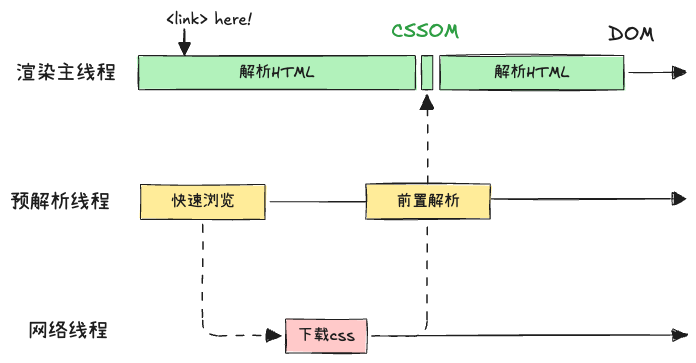
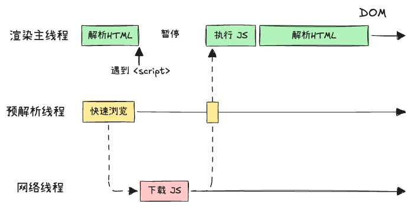
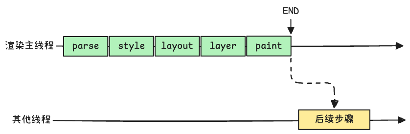
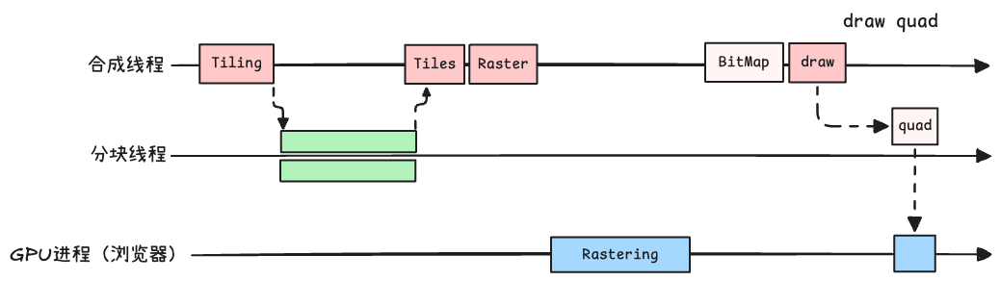

# Browser Rendering

渲染流水线：解析HTML -> 样式计算 -> 布局 -> 分层 -> 绘制 -> 分块 -> 光栅化 -> 画

## Parse

解析 HTML

渲染第一步是解析 HTML。遇到 CSS 解析 CSS，遇到 JS 执行 JS。为了提升解析效率，浏览器在开始解析前，会启动一个预解析线程，率先下载 HTML 外部的 CSS 文件与 JS 文件。

如果主线程解析到 `<link>` 位置，此时外部 CSS 文件还没有下载解析好，**主线程不会等待**，继续解析后续的 HTML。



如果解析到 `<script>` 位置，会停止解析 HTML，转而等待 JS 文件下载好，并将全局代码解析执行完成后，才会继续解析 HTML。

> 这是因为 JS 代码的执行过程中，可能会修改当前 DOM 树，所有 DOM 树的生成必须停止。这也是 JS 会阻塞 HTML 解析的根本原因。



### 设置 CSS 样式的方法

- `<link rel="stylesheet">`
- `<div style="">`
- `<style>`

## Style

样式计算

处理 CSSOM 树，得到计算后的样式(`Elements/Computed` tab)

- CSS 属性计算过程
- 视觉格式化模型，盒模型，包含块

相关 API：`getComputedStyle()`

## Layout

布局阶段会依次遍历 DOM 树的每个节点，计算节点的几何消息，例如：通过**包含块**来计算 `auto`、`100%` 等相对尺寸，得到 Layout 树。

DOM 树与 Layout 树不一定是一一对应的：

- `::before` 会被添加到 Layout 树中
- `display: none` 的元素不会出现在 Layout 树中，`<head>` 等标签被浏览器默认样式表设置为隐藏内容

  ```css
  /**
   * blink/renderer/core/html/resources/html.css
   */
  base,
  basefont,
  datalist,
  head,
  link,
  meta,
  noembed,
  noframes,
  param,
  rp,
  script,
  style,
  template,
  title {
    display: none;
  }
  ```

- 内容必须在行盒中（如果没有则会添加一个匿名行盒
- 行盒和块盒不能相邻（如果相邻则会添加一个匿名行盒）

  ```html
  <div>
    <p>a</p>
    b
    <p>c</p>
  </div>
  ```

相关 API：`el.clientWidth`，`el.offsetWidth` 等

## Layer

浏览器 `Layers` 面板

跟堆叠上下文有关的属性会影响到分层（`z-index`、`opacity`、`transform`）

滚动条单独分层 -> 因为频繁变动。在优化页面时，可以使用 `will-change` 让浏览器在分层时考虑这个模块的变动。

主线程会使用一套复杂的策略对整个布局树进行分层。分层的好处在于，将来某一个层改变后，仅会对该层进行后续处理，从而提升效率。

滚动条、堆叠上下文、`transform`、`opacity` 等样式都会或多或少的影响分层结果，也可以通过 `will-change` 属性更大层度的影响浏览器分层决策（注意不要滥用）。

## Paint

为每一层生成绘制指令

canvas就是使用这里的绘制指令

渲染主线程的工作到此为止，剩余步骤交给其他线程完成



## Tiling

分块会将每一层分为多个小的区域

使用合成线程（`Compositor`）执行分块逻辑，启动多个分块线程（`CompositorTileWorker`）

在主线程 paint 执行之后，主线程会将每个图层的绘制信息交给合成线程，剩余工作交给合成线程完成。

合成线程首先对每个图层进行分块，将其划分为更多的小区域，它会从线程池中拿去多个线程来完成分块工作

## Raster

将每个块变成位图，**优先处理靠近视口的块**

此过程会用到 GPU 加速（交给 GPU 进程处理）

## Draw

合成线程计算出每个位图在屏幕上的位置，交给 GPU 进行最终呈现



为什么合成线程不自己执行画操作？

> 合成线程与渲染主线程都是在渲染进程中，渲染进程在沙盒中（没有与操作系统进行直接连接），这是浏览器的安全机制。

合成线程拿到每个层、每个块的位图后，生成 quad (指引) 信息。指引会标识出每个位图应该画在屏幕的哪个位置，以及考虑旋转、缩放等变形。变形发生在合成线程，与主线程无关，这就是 `transform` 效率高的原因（在画的时候确定如何变形）。合成线程会把 quad 交个 GPU 进程，由 GPU 进程产生系统调用，提交给 GPU 硬件，完成最终的屏幕成像。

## Interview

- reflow：修改与几何消息相关的样式，修改的是 `CSSOM`，会重新执行 layout 之后的绘制流程，性能开销较大；

  > reflow 本质是重新计算 layout 树；为了避免连续多次操作导致 layout 树反复计算，浏览器会合并这些操作。
  > 当 JS 代码全部完成之后再进行统一计算。所以改动属性造成的 reflow 是异步完成的。
  >
  > 当 JS 获取布局属性时，可能造成无法获取最新的布局消息。为了解决这个问题，浏览器会在 JS 获取属性时立即 reflow

- repaint：本质是根据分层信息计算绘制指令，改变了可见样式后，就需要重新计算，从而引发 repaint。由于元素的布局消息也属于可见样式，因此 reflow 一定会引起 repaint

- 为什么 `transform` 效率高：`transform` 只影响 draw (合成线程)，不会阻塞渲染主线程
