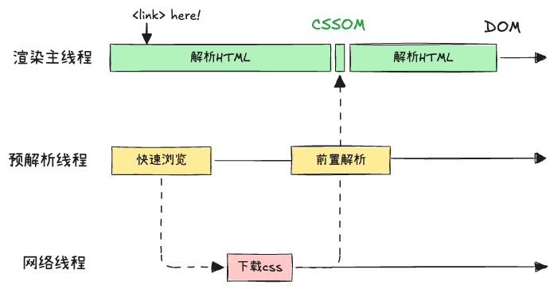
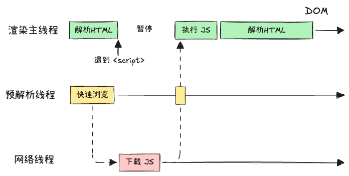
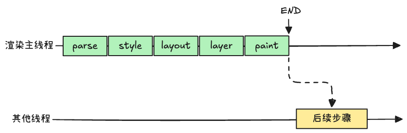
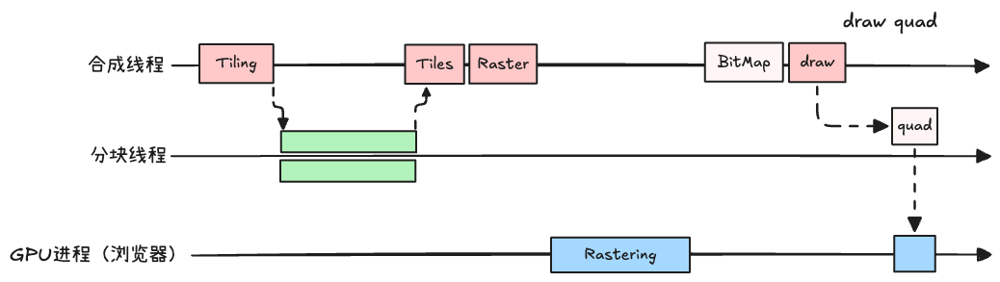

# Browser Rendering

以 Chromium 为例，主流程可以概括为：

```text
HTML/CSS parse → style → layout → pre-paint → paint → layerize → tile → raster → composite → display
```

这是理解模型，不是每次更新都完整执行。滚动或已合成动画可能只需重新合成；不同浏览器的内部阶段和线程划分也不完全相同。

## 1. Parse

HTML parser 把字节解码后的字符流转换为 token，并按 HTML 纠错规则构建 DOM。CSS parser 为已加载的样式表构建 CSSOM。

预加载扫描器会在主 parser 被阻塞等情况下向前扫描可发现的 URL，尽早请求 CSS、JavaScript、字体和图片。它与主解析并行协作，并不是“解析开始前先完成全部预解析”。



外部样式表通常不阻塞 HTML parser 继续构建 DOM，但会阻塞首次渲染。经典脚本若可能依赖前面的样式表，其执行还会等待这些样式加载完成。

没有 `async/defer` 的外部经典脚本会暂停 HTML 解析，等待下载并立即执行，因为脚本可能通过 `document.write` 或 DOM API 改变正在构建的文档。



`async`、`defer` 与 module script 的差异详见 `resourceLoading.md`。

## 2. Style

浏览器根据 UA 样式、作者样式、继承、层叠和选择器匹配，为需要渲染的节点计算 computed style。百分比、`em/rem` 和部分依赖布局的信息不一定都在同一内部阶段最终解析。

`getComputedStyle(element)` 返回解析后的只读样式视图。若前面存在未处理的样式修改，读取某些结果可能迫使浏览器先更新样式。

## 3. Layout

布局根据盒模型、格式化上下文、包含块和内容计算盒子的尺寸与位置，形成浏览器内部的 layout/fragment 数据。

DOM 与布局结构不是一一对应：

- `display: none` 和 `<head>` 等非渲染内容没有布局盒。
- `::before/::after` 可产生布局内容，但不是普通 DOM 子节点。
- 文本会形成匿名 inline box，行内内容排版进 line box。
- 块容器混合块级盒与行内内容时，规范可能生成匿名 block box 以满足格式化结构。
- 一个 DOM 元素在分页、多列和行内换行时可能生成多个 fragment。

读取 `offsetWidth`、`clientWidth`、`getBoundingClientRect()` 等几何信息时，浏览器必须返回当前结果；若样式或布局处于 dirty 状态，可能触发强制同步样式/布局。

## 4. Pre-paint、Paint 与 Layerization

布局之后，浏览器更新属性树、裁剪、滚动和绘制失效信息。Paint 生成按绘制顺序排列的 display items/display list，描述背景、边框、文字等如何绘制；它不是调用页面 Canvas API。



Layerization 决定哪些绘制内容进入独立 composited layer。堆叠上下文与合成层不是同一个概念：`z-index` 影响绘制和堆叠顺序，却不保证创建 GPU 合成层。动画、滚动、视频、3D transform 等因素都可能影响提升决策，浏览器可随时调整。

`will-change` 只是提前提示即将变化的属性，可能帮助浏览器准备优化，也可能增加纹理内存、合成和管理成本。应短期、针对性使用，并用 DevTools Layers/Performance 验证。

## 5. Tiling、Raster 与 Composite

主线程把可供合成使用的数据 commit 给 compositor thread。较大的内容会按 tile 管理，靠近视口的 tile 通常优先光栅化。光栅工作可由 worker 和 GPU/Viz 进程协调完成，具体位置会随平台与浏览器实现变化。

光栅化把 display list 变成像素纹理。compositor 根据 layer、tile、裁剪和 transform 生成 compositor frame；Chromium 的 Viz/display compositor 聚合页面和浏览器 UI 后提交显示。



合成线程可在主线程繁忙时处理部分滚动和 compositor-only animation，但前提是所需内容已光栅化且更新不依赖主线程样式、布局或绘制。

## 6. Reflow、Repaint 与 Composite

| 变化 | 可能经过的主要阶段 | 示例 |
| --- | --- | --- |
| Layout/Reflow | style → layout → paint → raster → composite | 改变宽高、字体、文档流位置 |
| Repaint | paint → raster → composite | 改背景色、阴影 |
| Composite only | composite | 已合成层的 transform/opacity 动画 |

表格表示常见情况，不是属性到流水线的永久映射。元素是否独立合成、失效范围和浏览器优化都会改变结果。

浏览器会延迟并合并样式与布局更新。若代码在写入后立即读取布局，就会迫使它提前结算；循环中的读写交错形成 layout thrashing：

```js
// Bad: repeated write-read cycles
for (const item of items) {
  item.style.width = `${nextWidth}px`
  console.log(item.offsetWidth)
}

// Better: read first, then write in a batch
const widths = items.map(item => item.offsetWidth)
items.forEach((item, index) => {
  item.style.width = `${widths[index] + 10}px`
})
```

## 7. transform 与 opacity 为什么通常更快

若元素已进入独立合成层，改变 `transform` 或 `opacity` 通常能复用已有纹理，只更新合成参数，跳过主线程 layout 和 paint。首次显示、未提升为合成层、内容失效或滤镜等组合条件仍可能需要绘制，且过多图层会消耗内存。

因此准确回答是“它们适合 compositor-only animation，通常成本较低”，而不是“transform 永远只走 GPU、与主线程无关”。
